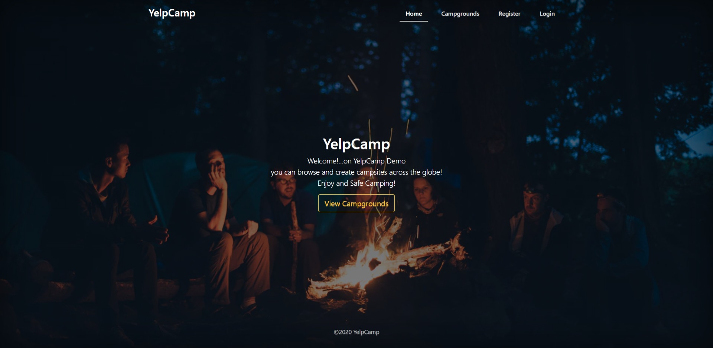
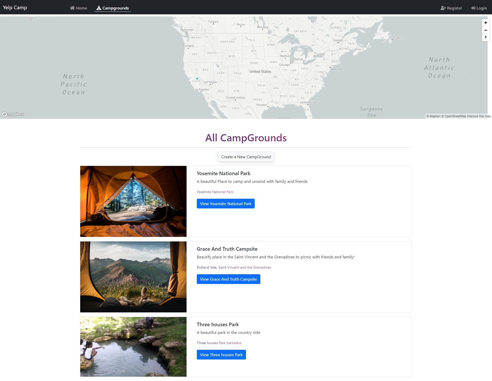

# YelpCamp-Demo

A published demo application of camp Locations. Where a user can sign up view, create , delete campgrounds.

This application was created in correspondence with the WebDevlopment Bootcamp courses taken in 2020, 

This application was built to show CRUD functionality, Content Security Policies, The use of API's, Express.

Also to show knowledge of nodejs and npm;

Added functionality such as starability, Maps and passport included using the node package manager.

Link to the demo below:

https://sheltered-atoll-93665.herokuapp.com/

<strong style="font-size:30px">HOME PAGE:-</strong>

